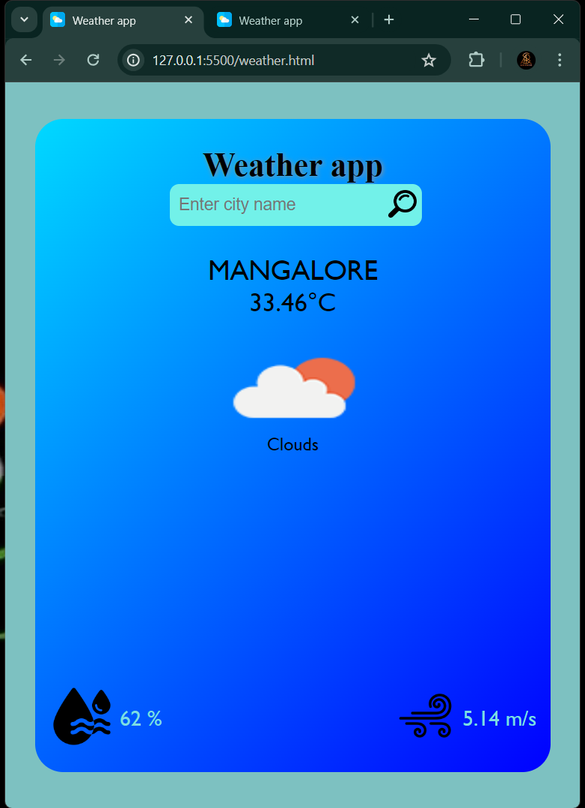

# Weather app

This source contains a simple and basic weather app using a public weather APIs.  
Since it does not having http respond from the API so website is not accessible.
## Demo of our app

Mainly, User can able to access there location's weather just by entering the **City name**.  

And user get information about **Temperature, Humidity and wind speed** also.  
This project purely based on **HTML, CSS and plain JavaScript**.

  

## Conclusion

We make this app accessible to users after learning GET and POST method in JS.  
Untill that please have the patience and we will get to know after updating...

**Thank you, Happy Coding..!**
